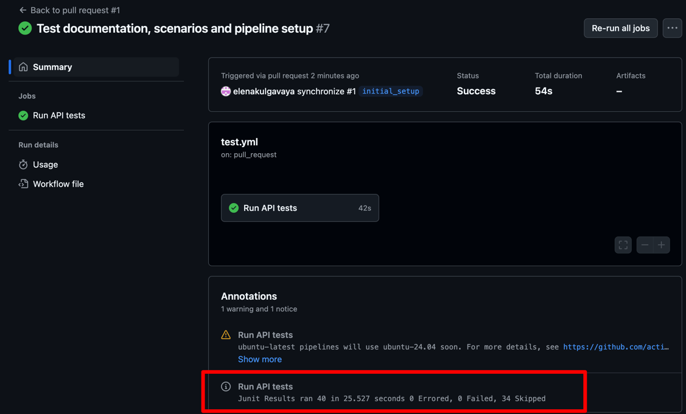
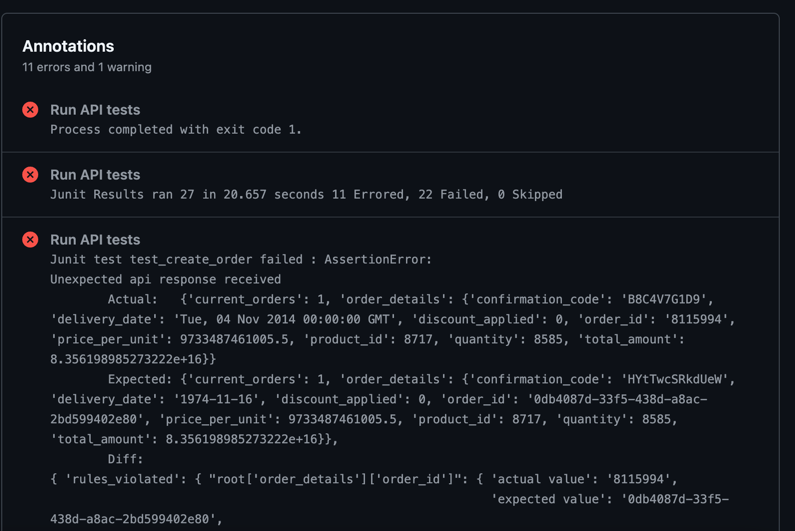

## Detailed setup and execution instructions

### Automated setup
The tests are setup to be executed on the GitHub actions pipelines. They will
start automatically on creating a new pull request, or can be triggered manually
from the action menu at
[Test Pipeline](https://github.com/elenakulgavaya/sample-api-tests/actions/workflows/test.yml)
Test results then can be observed on the run summary

It will also contain the information on the test failure in case of any


### Local setup for testing and development
The list of dependencies is specified in `requirements.text` and can be used
to setup the local environment for test execution.
Next step is to set a token for execution. It can either be done via 
environment variable. Use `SAMPLE_API_TEST_TOKEN` to store the tokent. Another
option is configuration file: Create /etc/local.yaml file with the content
```yaml
App:
  token: <YOUR_TOKEN_HERE>
```
Once all set the tests can be executed using the virtual environment and 
the command run from the root of the project `python main.py --local`
The test result will be exposed in the console having the information on
total tests, their statuses and also the failures if there are any.

### Running with test failures
In order to get the version where all the found issues are unmuted and the
results are adjusted to check the rest of the system, use
[This PR](https://github.com/elenakulgavaya/sample-api-tests/pull/2)
and either use the automated pipeline checking the results on the branch
`all_tests` or pull the change and run them locally.

[BACK](../README.md)
